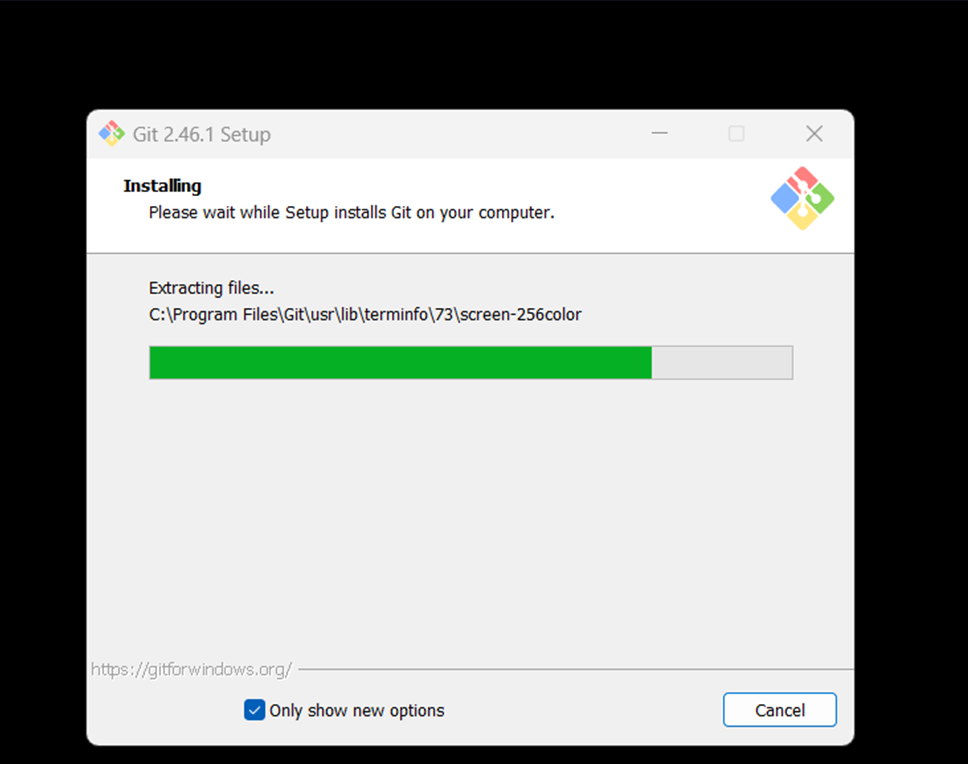
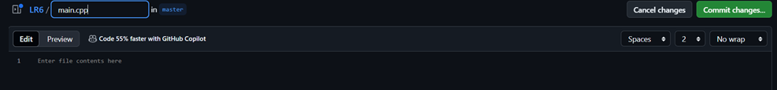
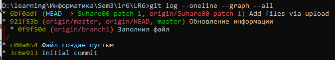
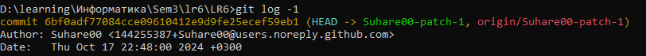
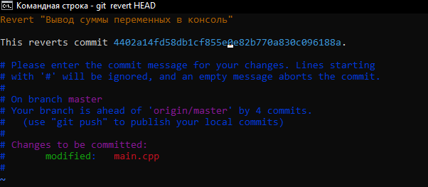
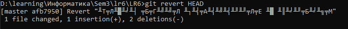

# LR6
Лабораторная работа №6

# Отчет по работе с Git

## 1. Создание форка
*Создаем форк репозиториия https://github.com/Kurtyanik/LR6/ *  

## 2. Установка Git
*Скриншот с процессом установки git*  


## 3. Изменение имени пользователя
Команда для изменения имени пользователя:

```bash
$ git config --global user.name "4317 Сухотченко Н.Д."
```

## 4. Клонирование репозитория

```bash
$ git clone https://github.com/Suhare00/LR6
```

## 5. Добавление нового файла
*Скриншет с добавлением нового файла*


## 6. Добавление изменений в локальный репозиторий

```bash
$ git pull
```

## 7. Получение данных для каждой из веток

```bash
$ git log --oneline --graph --all
```

*Результат работы команды*



## 8. Просмотр последних изменений

```bash
$ git log -1
```

*Результат работы команды*



## 9. Слияние веток

```bash
$ git checkout master
$ git marge Suhare00-patch-1
```

## 10. Удаление побочной ветки после слияния

```bash
$ git branch -d Suhare00-patch-1
```

## 11. Откат коммита
Откат к предыдущему коммиту:

```bash
$ git revert HEAD
```



## 12. Создание ветки для отчета

```bash
$ git checkout -b report-branch
```